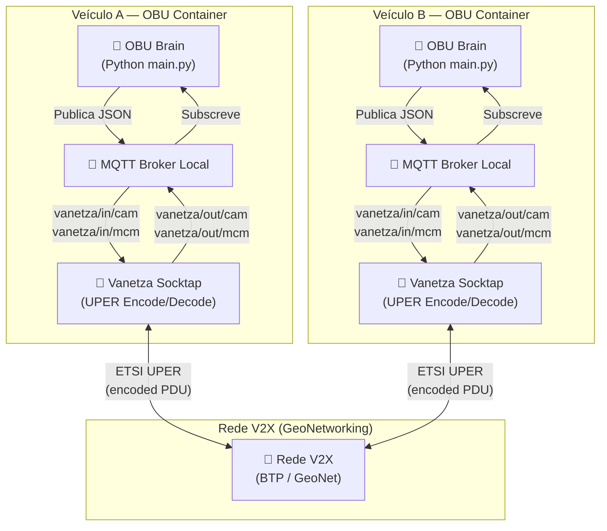
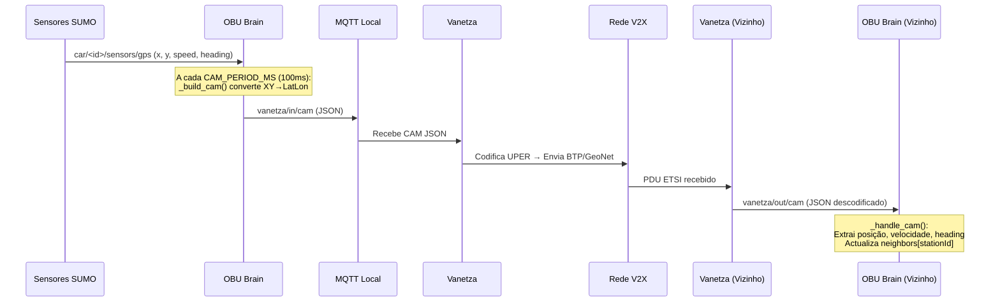
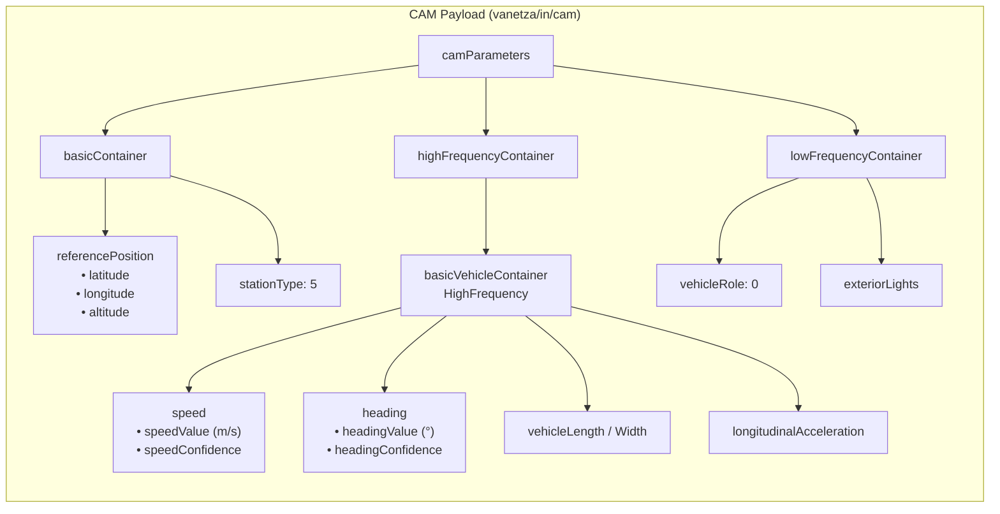
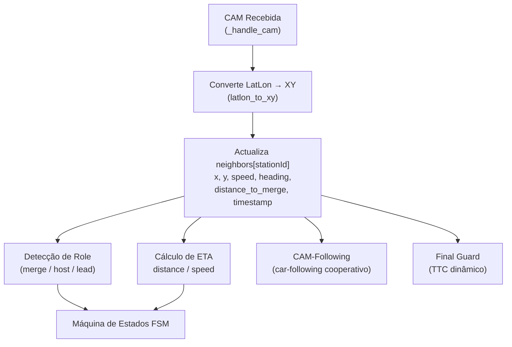
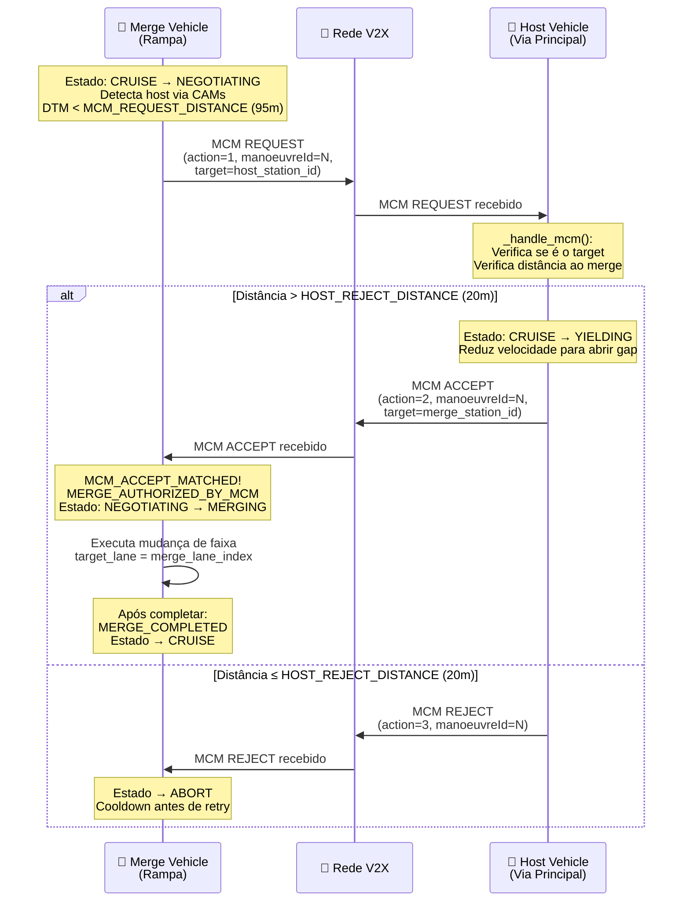
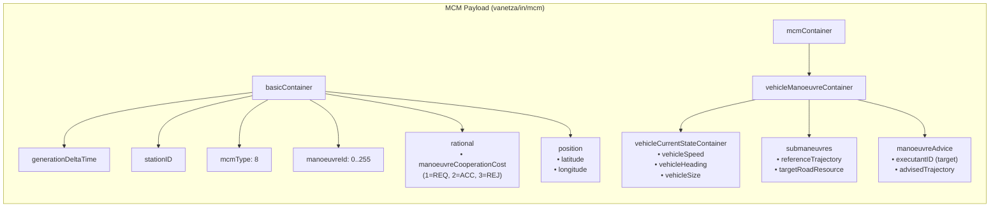
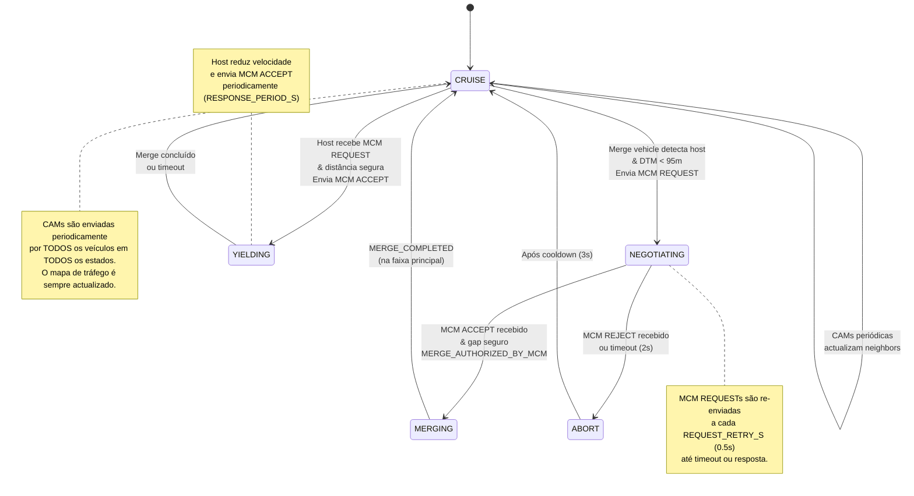
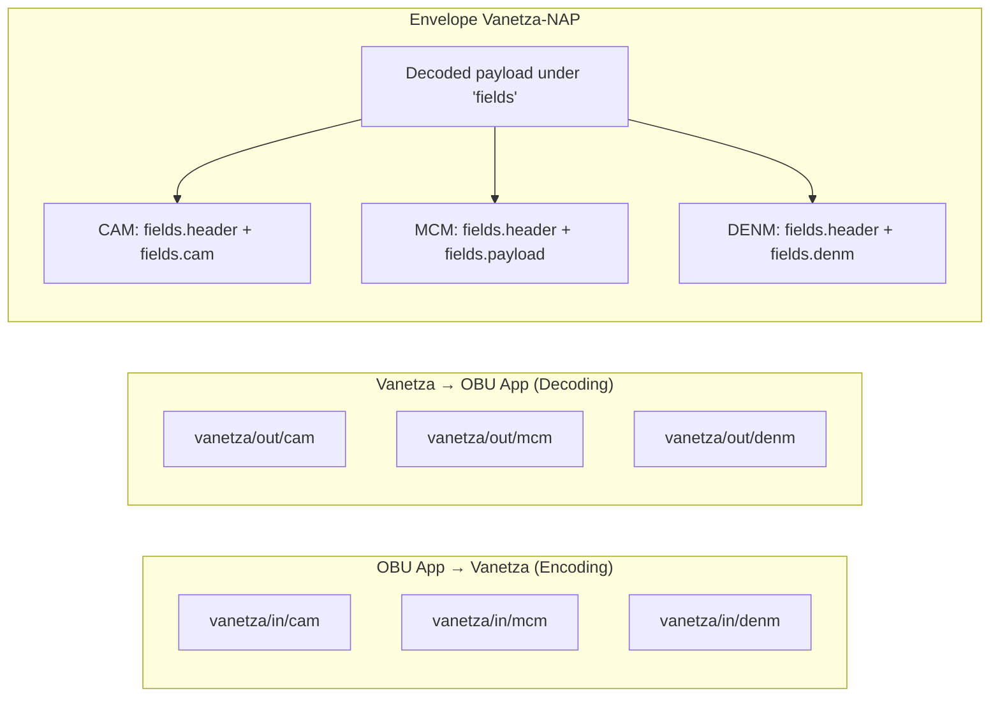

# CAM & MCM — Diagramas de Mensagens ETSI V2X

## 1. Arquitectura de Comunicação V2X

Visão geral de como as mensagens CAM e MCM fluem entre os OBUs através do Vanetza e MQTT.

---

## 2. CAM — Cooperative Awareness Message

### 2.1 Objetivo

A CAM é uma mensagem **periódica** enviada por cada veículo para anunciar a sua presença, posição, velocidade e estado cinemático. É o mecanismo de **awareness** — cada OBU constrói o seu mapa de tráfego local a partir das CAMs recebidas dos vizinhos.

### 2.2 Fluxo da CAM

### 2.3 Estrutura da CAM

### 2.4 Campos-Chave Utilizados pelo OBU

| Campo | Caminho JSON | Utilização |
|-------|-------------|------------|
| **Station ID** | `fields.header.stationId` | Identificação única do veículo |
| **Latitude** | `fields.cam.camParameters.basicContainer.referencePosition.latitude` | Conversão LatLon → XY SUMO |
| **Longitude** | `fields.cam.camParameters.basicContainer.referencePosition.longitude` | Conversão LatLon → XY SUMO |
| **Speed** | `fields.cam.camParameters.highFrequencyContainer.basicVehicleContainerHighFrequency.speed.speedValue` | Cálculo de ETA e car-following |
| **Heading** | `fields.cam.camParameters.highFrequencyContainer.basicVehicleContainerHighFrequency.heading.headingValue` | Projeção de trajetória e TTC |

### 2.5 Utilização da CAM no Sistema

---

## 3. MCM — Maneuver Coordination Message

### 3.1 Objetivo

A MCM é uma mensagem de **coordenação de manobra** utilizada para negociar a fusão (merge) entre veículos. Implementa um protocolo REQUEST → ACCEPT / REJECT que permite ao veículo da rampa pedir autorização ao host (veículo da via principal) para entrar.

### 3.2 Tipos de Ação MCM

| Código | Nome | Descrição |
|--------|------|-----------|
| `1` | **REQUEST** | Veículo merge pede autorização para entrar |
| `2` | **ACCEPT** | Veículo host autoriza a manobra |
| `3` | **REJECT** | Veículo host recusa (demasiado perto do merge point) |

> [!IMPORTANT]
> O campo `manoeuvreCooperationCost` no `basicContainer.rational` é utilizado como o campo de ação (1=REQUEST, 2=ACCEPT, 3=REJECT). O `manoeuvreId` deve estar no intervalo `0..255` (Identifier1B).

### 3.3 Fluxo de Negociação MCM

### 3.4 Estrutura da MCM

### 3.5 Campos-Chave Utilizados pelo OBU

| Campo | Caminho JSON | Utilização |
|-------|-------------|------------|
| **Station ID** | `fields.header.stationId` ou `basicContainer.stationID` | Quem enviou a MCM |
| **Action** | `basicContainer.rational.manoeuvreCooperationCost` | Tipo: REQUEST(1) / ACCEPT(2) / REJECT(3) |
| **Manoeuvre ID** | `basicContainer.manoeuvreId` | Identificador da manobra (0..255) |
| **Target** | `mcmContainer.vehicleManoeuvreContainer.manoeuvreAdvice[0].executantID` | Para quem se destina |
| **Speed** | `mcmContainer.vehicleManoeuvreContainer.vehicleCurrentStateContainer.vehicleSpeed.speedValue` | Velocidade actual do emissor |
| **Position** | `basicContainer.position.latitude / longitude` | Posição actual do emissor |

---

## 4. Integração CAM + MCM no FSM

---

## 5. Tópicos MQTT — Resumo

---

## 6. Comparação CAM vs MCM

| Aspecto | CAM | MCM |
|---------|-----|-----|
| **Tipo** | Periódica (awareness) | Orientada a eventos (negociação) |
| **Frequência** | Cada `CAM_PERIOD_MS` (100ms) | Quando necessário (REQUEST/ACCEPT/REJECT) |
| **Direção** | Broadcast (todos os vizinhos) | Dirigida (via `executantID`) |
| **Conteúdo Principal** | Posição, velocidade, heading | Ação de coordenação, manoeuvreId, target |
| **Standard ETSI** | EN 302 637-2 | ETSI TS 103 561 |
| **Envelope Vanetza** | `fields.cam` | `fields.payload` |
| **Função no Sistema** | Mapa de tráfego, ETA, car-following | Negociação de merge (REQ/ACC/REJ) |
| **Todos os estados?** | ✅ Sempre enviada | ❌ Só em NEGOTIATING/YIELDING |
